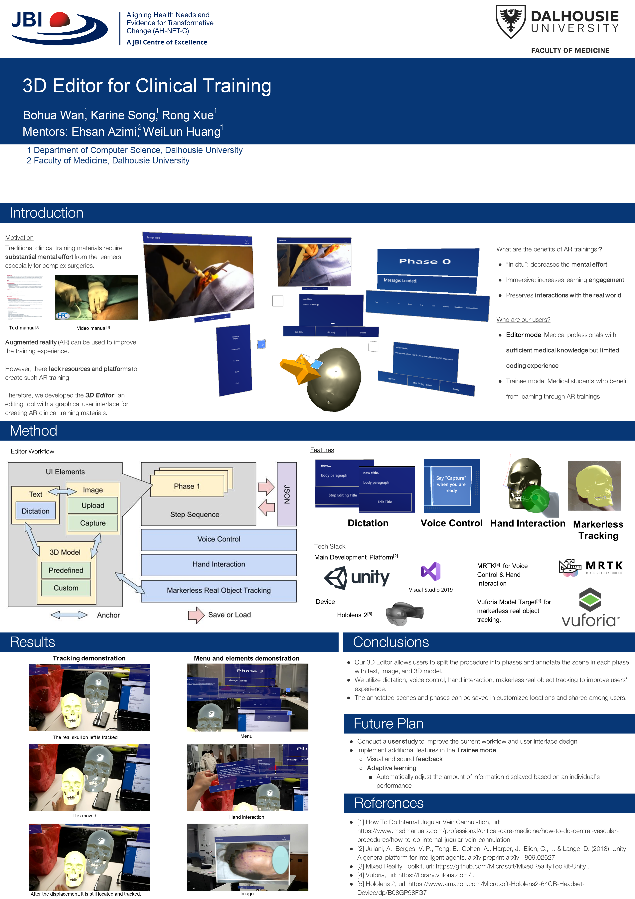

# 3D-Editor

## Platforms and third party packages:
1. [Unity](https://unity.com) for development. Unity Editor version: 2020.3.20f1. Newer version may not work.
2. [Visual Studio 2019 Community](https://docs.microsoft.com/en-us/visualstudio/releases/2019/release-notes) for development.
3. [MRTK](https://github.com/microsoft/MixedRealityToolkit-Unity/releases) v 2.7.3  for voice command, voice dictation, and hand interaction.
4. [Vuforia](https://library.vuforia.com) for markerless tracking using the Model Target utility from Vuforia.
5. [AsImpL](https://github.com/gpvigano/AsImpL) for runtime custom 3D model import.
6. [Arrow WayPointer](https://assetstore.unity.com/packages/tools/particles-effects/arrow-waypointer-22642?locale=zh-CN) for the arrow 3D model.

## How to build:
1. Install 2020.3.20f1 Unity Editor if not already installed. Download [Vuforia SDK for Unity] (https://developer.vuforia.com/downloads/sdk). 
2. Open Packages/manifest.json, delete the line: "com.ptc.vuforia.engine":"file:com.ptc.vuforia.engine-10.[version number].tgz"
3. Open this project from Unity Hub. If prompted with compilation error warning, select "Ignore".
4. Once opened, Select Assets > Import Package > Custom, select the Vuforia SDK you downloaded, and select "Import".
5. Make sure project scripts have been fully recompiled. Go to Window > Package Manager and make sure Vuforia Engine AR is there.
6. Open the Assets/Scenes/MenuScene scene.
7. Click the play button to run.

## Sample trainings:
There are some sample trainings in the Assets/Resources/Demo/ folder. After you started our system, go to editor mode, click load and select one of the demos to try.

## Custom 3D Model:

We support runtime custom 3D Model import. In the editor mode, click 3D>Import and then select your .obj 3D Model. Only Wavefront 3D models are supported at the moment.
